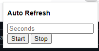

Chrome Tab Auto Refresher Extension
-
This extension allows user to refresh multiple tabs, even those in another window, each with their own interval

How to use:

1) clone repo
2) enable developer mode on browser
3) add extension (repo path)
4) type in interval (in seconds) that you want to refresh current tab into box

    

5) click start
6) click stop when you don't want to refresh tab anymore
7) repeat for other tabs you want to refresh concurrently
